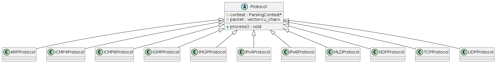
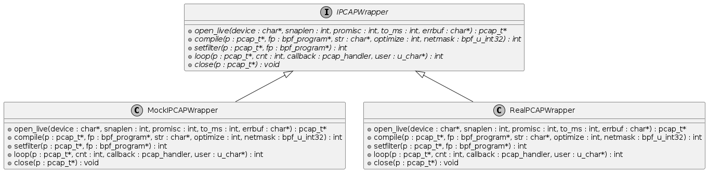
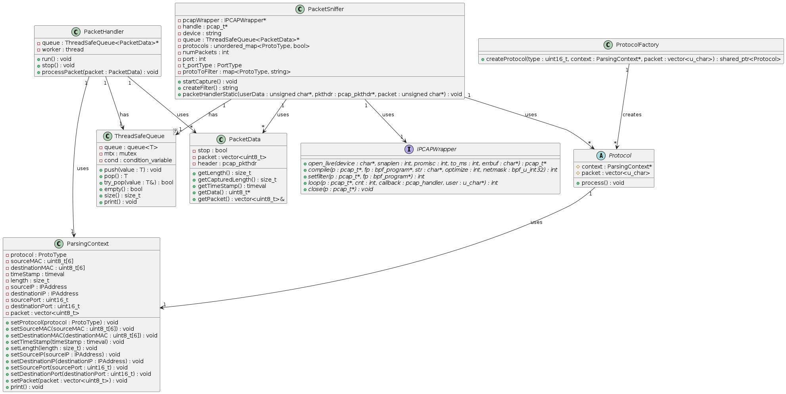
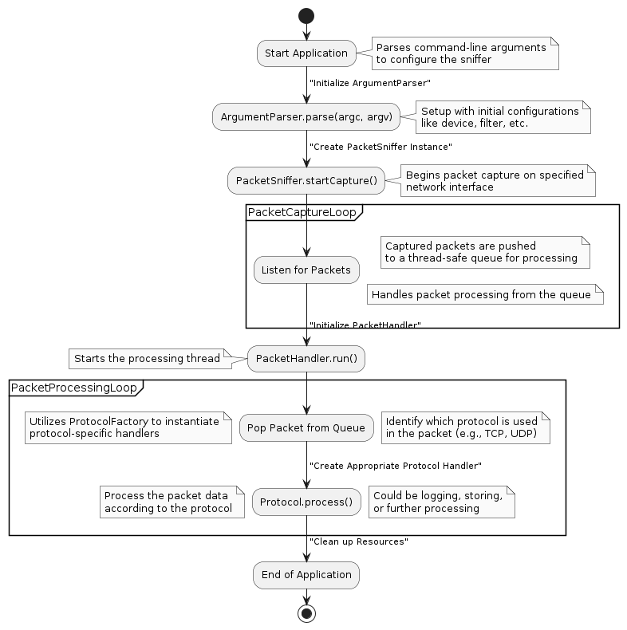

# IPK-network-sniffer

## Table of Contents
- [IPK-network-sniffer](#ipk-network-sniffer)
  - [Table of Contents](#table-of-contents)
  - [Theory](#theory)
    - [OSI Model](#osi-model)
      - [Encapsulation](#encapsulation)
      - [Protocol Locations in the OSI Model](#protocol-locations-in-the-osi-model)
    - [IP Extensions and Options](#ip-extensions-and-options)
    - [Link Types](#link-types)
  - [Design Overview](#design-overview)
    - [Structure Overview](#structure-overview)
      - [Protocol Class Hierarchy](#protocol-class-hierarchy)
      - [IPCAPWrapper and its Implementations](#ipcapwrapper-and-its-implementations)
      - [Comprehensive Class Diagram](#comprehensive-class-diagram)
    - [System Operation Workflow](#system-operation-workflow)
    - [Use of Threading](#use-of-threading)
  - [Implementation](#implementation)
      - [`ArgumentParser`](#argumentparser)
      - [`PacketData`](#packetdata)
      - [`PacketHandler`](#packethandler)
      - [`PacketSniffer`](#packetsniffer)
      - [`ParsingContext`](#parsingcontext)
      - [`PortType`](#porttype)
      - [`ProtoType`](#prototype)
      - [`IPAddress`](#ipaddress)
      - [`Protocol`](#protocol)
      - [`ProtocolFactory`](#protocolfactory)
      - [`SignalHandler`](#signalhandler)
      - [`ThreadSafeQueue`](#threadsafequeue)
      - [`ARPProtocol`](#arpprotocol)
      - [`ICMP4Protocol`](#icmp4protocol)
      - [`ICMP6Protocol`](#icmp6protocol)
      - [`IGMPProtocol`](#igmpprotocol)
      - [`IMGPProtocol`](#imgpprotocol)
      - [`IPv4Protocol`](#ipv4protocol)
      - [`IPv6Protocol`](#ipv6protocol)
      - [`MLDProtocol`](#mldprotocol)
      - [`NDPProtocol`](#ndpprotocol)
      - [`TCPProtocol`](#tcpprotocol)
      - [`UDPProtocol`](#udpprotocol)
      - [`IPCAPWrapper`](#ipcapwrapper)
      - [`MockIPCAPWrapper`](#mockipcapwrapper)
      - [`RealIPCAPWrapper`](#realipcapwrapper)
  - [Testing](#testing)
  - [Bibliography](#bibliography)

## Theory

### OSI Model
The Open Systems Interconnection (OSI) model is a conceptual framework used to understand network interactions in seven layers. Each layer serves a specific function and communicates with the layers directly above and below it:

1. Physical Layer: Deals with the physical aspects of data transmission, including cable or radio signal types.
2. Data Link Layer: Responsible for node-to-node data transfer and error correction from the physical layer.
3. Network Layer: Handles routing of data packets across networks.
4. Transport Layer: Provides end-to-end communication services for applications.
5. Session Layer: Manages sessions between applications.
6. Presentation Layer: Translates data between the application layer and the network.
7. Application Layer: Provides networking services to applications.

#### Encapsulation
Encapsulation is a process in the Data Link, Network, and Transport layers where data from a higher layer is wrapped with necessary protocol information before passing it down to a lower layer. This involves adding headers (and sometimes trailers) to the data. For example, in an Ethernet-based network, an IP packet (from the Network layer) is encapsulated within an Ethernet frame at the Data Link layer.

#### Protocol Locations in the OSI Model
```
+-----------------+---------------------------------------------------+
| OSI Layer       | Protocols                                         |
+-----------------+---------------------------------------------------+
| 7. Application  | -                                                 |
| 6. Presentation | -                                                 |
| 5. Session      | -                                                 |
| 4. Transport    | TCP, UDP                                          |
| 3. Network      | IP (IPv4, IPv6), ICMP                             |
| 2. Data Link    | Ethernet, ARP                                     |
| 1. Physical     | - (Ethernet standards also define physical layer  |
|                 | characteristics, but specific physical layer      |
|                 | protocols like DSL, Fiber, etc., are not listed)  |
+-----------------+---------------------------------------------------+
```
- TCP/UDP (Transport Layer): These protocols are responsible for end-to-end communication. TCP provides reliable transmission with flow control and error handling, while UDP offers a connectionless service for applications that require speed over reliability.
- ICMP4/ICMP6 (Network Layer): Internet Control Message Protocol is used for sending error messages and operational information indicating, for example, that a requested service is not available or that a host or router could not be reached.
- ARP/NDP (Data Link Layer): Address Resolution Protocol (ARP) and Neighbor Discovery Protocol (NDP) are used for mapping IP addresses to physical machine (MAC) addresses. ARP is used with IPv4 and NDP is part of the IPv6 specification.
- IGMP/MLD (Network Layer): Internet Group Management Protocol (IGMP) and Multicast Listener Discovery (MLD) are used to manage group membership for multicast traffic. IGMP is used with IPv4, while MLD is used with IPv6.
- IPv4/IPv6 (Network Layer): Internet Protocol versions 4 and 6 are the primary protocols for routing traffic across the Internet.

### IP Extensions and Options
IP headers can be extended with options to provide additional capabilities. Common options for IPv4 include security options (like the IPsec suite), record route (which stores the route of a packet), and timestamp options (which can be used for round-trip time measurements). IPv6 has a more streamlined approach with extension headers, which facilitate features like routing (alternate routing), fragmentation, and authentication.

### Link Types
In network packet capturing, the link type specifies the link protocol's type. Since this project uses only LINKTYPE_ETHERNET, the following applies:

- Ethernet: The most common link type for local area networks (LANs). Ethernet frames encapsulate various network layer protocols such as IP packets and have a well-defined format including source and destination MAC addresses, a type field (to indicate the network layer protocol), and a frame check sequence for error detection.

## Design Overview

This project is designed to capture and analyze network packets efficiently using the `libpcap` library. The system architecture utilizes object-oriented programming principles to modularize the process into clear, manageable components such as packet capturing, packet handling, and protocol processing.

### Structure Overview

#### Protocol Class Hierarchy

The diagram in Figure 1 illustrates the Protocol class and its derived classes, demonstrating a clear example of generalization and specialization in object-oriented design. The Protocol class serves as an abstract base, defining a common interface for all specialized protocol handlers such as `TCPProtocol`, `UDPProtocol`, and `ICMP4Protocol`. This modular and scalable design allows for easy extension as new protocols need to be supported, enhancing the maintainability and adaptability of the packet processing framework.


*Figure 1: Part of the Class Diagram showing Protocol and its derived classes.*

#### IPCAPWrapper and its Implementations

Figure 2 shows the `IPCAPWrapper` class and its concrete implementations: `MockIPCAPWrapper` and `RealIPCAPWrapper`. The `IPCAPWrapper` abstracts library-specific functions of `libpcap`, a standard packet capture library in Unix environments, to promote code maintainability and testing. `RealIPCAPWrapper` uses real `libpcap` calls for live environments, while `MockIPCAPWrapper` is used within Google Test frameworks for simulating pcap functionalities without accessing real network hardware. This setup underscores the importance of a maintainable codebase that can be robustly tested.


*Figure 2: Part of the Class Diagram showing the IPCAPWrapper and its derived classes.*

#### Comprehensive Class Diagram

The diagram in Figure 3 provides a complete overview of the system's architecture. The `ProtocolFactory` is central for creating appropriate protocol handlers dynamically based on detected packet types. `PacketSniffer` is responsible for opening a network session, setting up filters, and sniffing packets. `PacketHandler`, in conjunction with ThreadSafeQueue, manages packet processing; `PacketSniffer` places packets into the queue, and `PacketHandler` processes them as they arrive. This architecture effectively decouples packet capture from packet processing, facilitating efficient data handling and processing through multithreading.


*Figure 3: Class Diagram showing the relationships and structure of the classes within the system.*
> **Note:** `ArgumentParser` was omitted from the diagram for brevity, as it is a standalone class.

### System Operation Workflow

The flow diagram in Figure 4 illustrates the process flow from the start of the application to the processing of packets. It highlights the dynamic interactions between components such as the `ArgumentParser`, `PacketSniffer`, `ThreadSafeQueue`, and `PacketHandler`.



*Figure 4: Flow Diagram depicting the operational flow from packet capture to packet processing.*

### Use of Threading

To combat potential buffer overflow issues with the network card and to manage the high throughput of network data, the application employs a multithreading approach with a thread-safe queue. This design choice is crucial for the following reasons:

- **Asynchronous Processing**: The `PacketSniffer` captures packets and enqueues them into a `ThreadSafeQueue`. This decouples the packet capture from the packet processing, allowing both to occur simultaneously without waiting for one to complete before the other starts.

- **Buffer Overflow Prevention**: By immediately moving captured packets into a queue, we mitigate the risk of losing packets that could occur due to buffer overflow in the network card's buffer, especially under high traffic conditions.

- **Enhanced Performance**: Utilizing separate threads for capturing and processing packets takes advantage of multi-core processors, improving the application's overall performance and responsiveness.

This threaded approach ensures that the system can handle large volumes of network data efficiently and reliably, making it suitable for both development and production environments for network analysis and troubleshooting.

## Implementation

#### `ArgumentParser`

-   **Purpose**: Parses command-line arguments to configure the packet sniffer's settings.
-   **Key Functionalities**:
    -   Parses user inputs to extract interface names, port numbers, and protocol filters.
    -   Provides a method to display configuration settings and usage instructions.

#### `PacketData`

-   **Purpose**: Represents the data structure for storing packet information after capture.
-   **Key Functionalities**:
    -   Stores both raw packet data and metadata such as timestamps and captured lengths.
    -   Provides accessors for retrieving packet specifics like length and timestamps.

#### `PacketHandler`

-   **Purpose**: Manages the processing of packets from a capture queue using protocol handlers.
-   **Key Functionalities**:
    -   Runs a processing loop that dequeues packets and applies protocol-specific parsing.
    -   Can be stopped gracefully to manage packet processing shutdown.

#### `PacketSniffer`

-   **Purpose**: Handles the setup and execution of packet captures using `pcap`.
-   **Key Functionalities**:
    -   Configures and initiates packet capture on specified interfaces with necessary filters.
    -   Interacts with `IPCAPWrapper` to abstract pcap functionalities like opening a device and setting filters.

#### `ParsingContext`

-   **Purpose**: Stores contextual information for a packet being processed to assist protocol handlers.
-   **Key Functionalities**:
    -   Manages and validates the setting of various packet attributes like source/destination IPs, ports, and MAC addresses.
    -   Provides formatted outputs for debugging and logging packet information.

#### `PortType`

-   **Purpose**: Enumerates types of port settings (source, destination, any) for filtering purposes.
-   **Key Functionalities**:
    -   Defines port filtering options used in constructing capture filters.

#### `ProtoType`

-   **Purpose**: Enumerates the protocol types to standardize protocol identification across handlers.
-   **Key Functionalities**:
    -   Provides a consistent set of identifiers for network protocols like TCP, UDP, and ICMP.

#### `IPAddress`

-   **Purpose**: Encapsulates IPv4 and IPv6 address handling within the network packets.
-   **Key Functionalities**:
    -   Provides methods to convert IP addresses from binary to human-readable form.
    -   Supports both IPv4 and IPv6 address transformations.

#### `Protocol`

-   **Purpose**: Abstract base class for protocol-specific handlers that process packets.
-   **Key Functionalities**:
    -   Defines a common interface for all protocol handlers to implement packet processing methods.

#### `ProtocolFactory`

-   **Purpose**: Implements the Factory Design Pattern to instantiate protocol handlers based on packet data.
-   **Key Functionalities**:
    -   Dynamically creates instances of derived `Protocol` classes based on the protocol type detected in the packet.

#### `SignalHandler`

-   **Purpose**: Manages system signals for graceful shutdown and logging.
-   **Key Functionalities**:
    -   Intercepts and processes system signals to handle events like application termination.

#### `ThreadSafeQueue`

-   **Purpose**: Provides a thread-safe queue implementation for storing and accessing packets across multiple threads.
-   **Key Functionalities**:
    -   Enforces exclusive access to the queue's front and back to prevent race conditions.

#### `ARPProtocol`

-   **Purpose**: Handles parsing and processing of ARP packets.
-   **Key Functionalities**:
Extracts ARP-specific information such as sender and target IP addresses.

#### `ICMP4Protocol`

-   **Purpose**: Manages the parsing of ICMPv4 packets.
-   **Key Functionalities**:
    -   Sets protocol type in the `ParsingContext`.

#### `ICMP6Protocol`

-   **Purpose**: Manages the parsing of ICMPv6 packets.
-   **Key Functionalities**:
    -   Sets protocol type in the `ParsingContext`.

#### `IGMPProtocol`

-   **Purpose**: Parses Internet Group Management Protocol packets for managing IPv4 multicast groups.
-   **Key Functionalities**:
    -   Sets protocol type in the `ParsingContext`.

#### `IMGPProtocol`

-   **Purpose**: Manages parsing of IMGP messages, a hypothetical or specialized protocol.
-   **Key Functionalities**:
    -   Sets protocol type in the `ParsingContext`.

#### `IPv4Protocol`

-   **Purpose**: Specializes in parsing IPv4 packets including header information and encapsulated payloads.
-   **Key Functionalities**:
    -   Extracts source and destination IP addresses and protocol types from IPv4 headers.
    -   Calls the `ProtocolFactory` to create protocol handlers for encapsulated packets.
    -   Calls processing methods on the created protocol handlers.

#### `IPv6Protocol`

-   **Purpose**: Handles the parsing of IPv6 packets, addressing the complexities of IPv6 including extension headers.
-   **Key Functionalities**:
    -   Manages extended addressing.
    -   Calls the `ProtocolFactory` to create protocol handlers for encapsulated packets.
    -   Calls processing methods on the created protocol handlers.

#### `MLDProtocol`

-   **Purpose**: Manages parsing for Multicast Listener Discovery messages used in IPv6.
-   **Key Functionalities**:
    -   Sets protocol type in the `ParsingContext`.

#### `NDPProtocol`

-   **Purpose**: Parses Neighbor Discovery Protocol packets for IPv6 address resolution and management.
-   **Key Functionalities**:
    -   Sets protocol type in the `ParsingContext`.

#### `TCPProtocol`

-   **Purpose**: Provides parsing and processing of TCP packets.
-   **Key Functionalities**:
    -   Extracts TCP headers including port numbers.

#### `UDPProtocol`

-   **Purpose**: Specializes in parsing UDP packets, which are used for connectionless communication.
-   **Key Functionalities**:
    -   Extracts source and destination ports.

#### `IPCAPWrapper`

-   **Purpose**: Defines an abstract interface to the `pcap` library functions to enable mock implementations and real interactions.
-   **Key Functionalities**:
    -   Abstracts `pcap` operations such as opening a capture device and compiling and setting filters.

#### `MockIPCAPWrapper`

-   **Purpose**: Provides a mock implementation of IPCAPWrapper for testing without actual network packet captures.
-   **Key Functionalities**:
    -   Simulates `pcap` functions allowing for comprehensive testing of network analysis logic in isolation.

#### `RealIPCAPWrapper`

-   **Purpose**: Implements the `IPCAPWrapper` interface with actual `libpcap` function calls for live network packet capturing.
-   **Key Functionalities**:
    -   Enables real packet captures with filter application, useful in deployed environments for traffic analysis.


## Testing

TODO


## Bibliography

> **Note:** Production of this README was accelerated by [chatGPT4](https://chat.openai.com/)